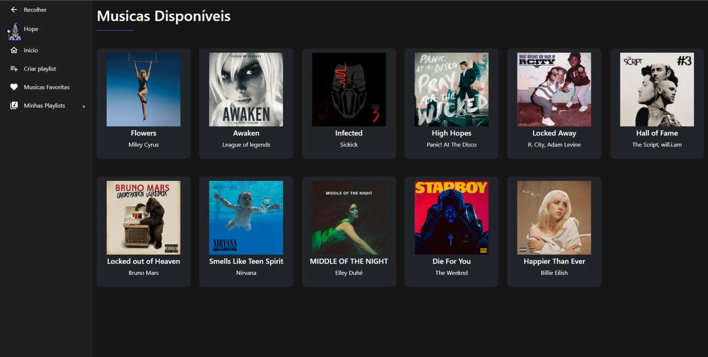

<h1>🚀 Projeto Smify 2.0 - Frontend 🚀</h1>

Projeto desenvolvido em ReactJS, TypeScript, ESLint e Husky

💡 <strong>O que fazem o ESLint e Husky?</strong>

<ul>
    <li><strong>ESLint:</strong> O ESLint é uma ferramenta que ajuda a identificar e corrigir erros de código, aplicando regras de estilo e boas práticas de programação.</li>
    <li><strong>Husky:</strong> O Husky é utilizado neste projeto para automatizar tarefas antes de confirmar alterações no Git, como a execução do ESLint para garantir que o código esteja limpo e livre de erros.</li>
</ul>

Para acessar o código do backend da aplicação smify, visite o repositório correspondente:

<a href="https://github.com/pedrohhope/smify-v2-backend" style="font-size: 1.2em; background-color: #2ecc71; color: #fff; padding: 10px 20px; text-decoration: none; border-radius: 5px;">Repositório do Backend</a>

Para começar a contribuir ou executar este projeto localmente, siga estas etapas:

<ol>
    <li>Clone este repositório: <code>git clone https://github.com/pedrohhope/smify-v2.git</code></li>
    <li>Instale as dependências: <code>yarn</code></li>
    <li>Execute o aplicativo: <code>yarn dev</code></li>
</ol>

Divirta-se codificando e melhorando a aplicação smify!

